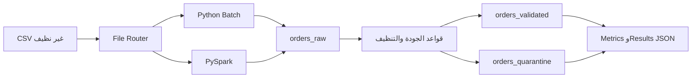
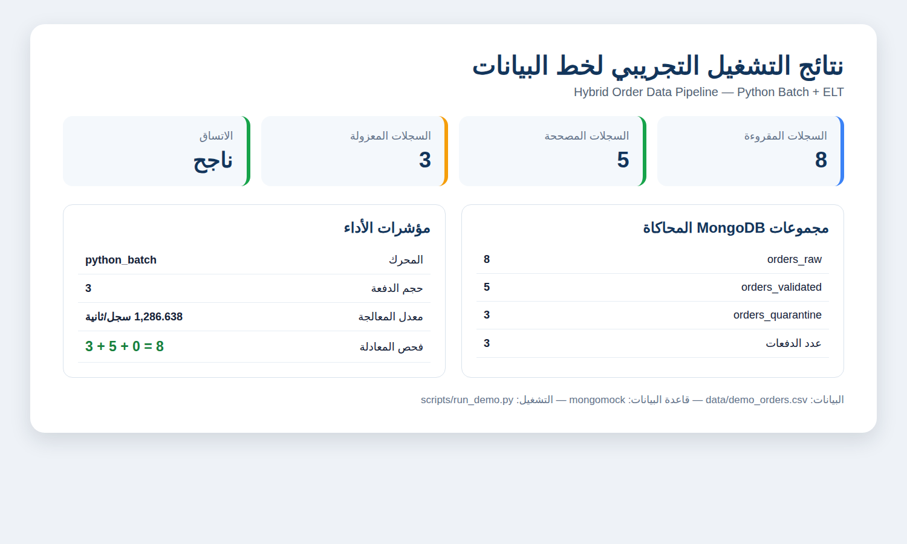
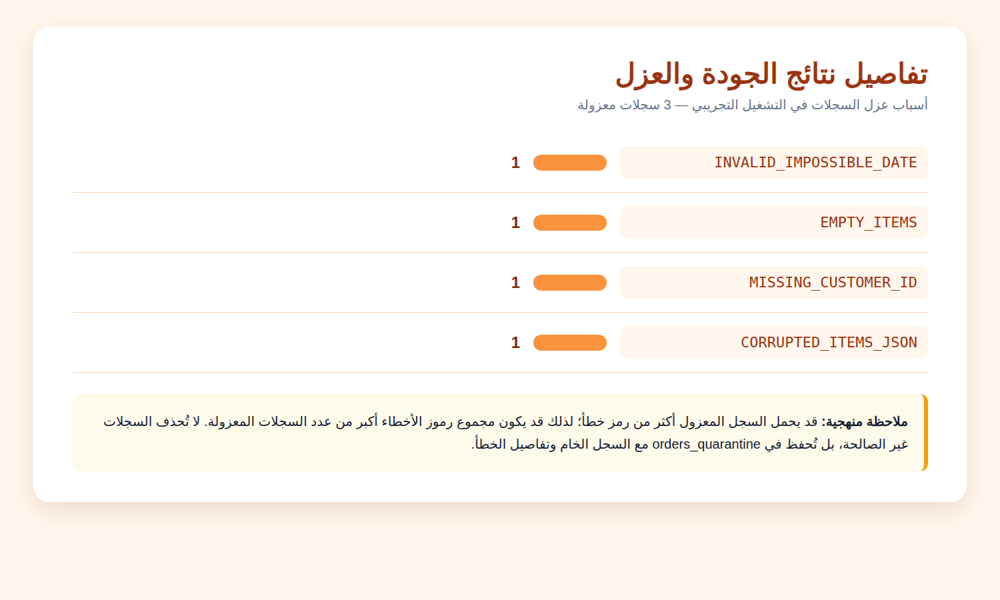

# مشروع منتصف الفصل: Hybrid Order Data Pipeline

## بيانات الطالب

| البيان | المعلومات |
|---|---|
| عمل الطالب | عبدالرزاق محمد الصرابي |
| التخصص | ذكاء اصطناعي |
| السنة الدراسية | السنة الرابعة |
| المشرف | م. عمار أبو سند |

## 1. فكرة المشروع وهدفه

ينفذ هذا المشروع خط بيانات هجينًا لمعالجة ملفات طلبات بصيغة CSV تحتوي على بيانات متفاوتة الجودة. يهدف النظام إلى تحميل كل سجل خام أولًا، ثم تنظيفه والتحقق منه وتصنيفه إلى سجل صالح أو سجل مصحح أو سجل معزول للمراجعة. صُمم الحل بحيث لا يؤدي وجود خطأ في سجل واحد إلى إسقاطه أو فقدانه، بل يحتفظ بالسجل الخام وتفاصيل المعالجة وسبب العزل عند الحاجة.

يعتمد المشروع على نمط **ELT**؛ أي أن التحميل إلى مجموعة البيانات الخام يحدث قبل تطبيق قواعد التحويل والجودة. كما يختار النظام محرك التنفيذ تلقائيًا بحسب حجم الملف: يستخدم **Python Batch** للملفات الصغيرة، ويمكنه استخدام **PySpark** للملفات الكبيرة أو عند فرض المحرك أثناء العرض.

> **المبدأ التشغيلي:** كل سجل خام يجب أن ينتهي إلى إحدى النتائج التالية: `valid` أو `corrected` أو `quarantine`، ولا يجوز إسقاط السجلات غير الصالحة بصمت.

## 2. بنية الحل ومسار البيانات

يمر السجل بالمراحل التالية:

1. يقرأ `file_router.py` حجم الملف ويختار محرك التنفيذ المناسب.
2. يقرأ `batch_loader.py` ملف CSV على شكل دفعات Streaming لتقليل استهلاك الذاكرة.
3. يحفظ كل سجل كما وصل في مجموعة `orders_raw` مع رقم التشغيل ورقم الصف واسم الملف.
4. يطبق `quality_rules.py` قواعد التنظيف والتصنيف، مثل توحيد التاريخ والعملة والأرقام العربية والهاتف والبريد الإلكتروني.
5. يرسل السجل القابل للتصحيح أو السليم إلى `orders_validated` باستخدام `Upsert` وفهرس فريد على `order_id`.
6. يرسل السجل غير القابل للتصحيح إلى `orders_quarantine` مع `error_codes` و`error_details` ونسخة `raw_record`.
7. تجمع `metrics.py` مؤشرات التشغيل وتتحقق من معادلة الاتساق.



التوثيق المعماري التفصيلي موجود في [docs/architecture.md](docs/architecture.md).

## 3. مجموعات البيانات وقواعد الاتساق

| المجموعة | الوظيفة | الضمانات |
|---|---|---|
| `orders_raw` | نسخة المصدر كما وصلت | تحفظ `run_id` و`source_file` و`source_row_number` ولا تستخدم Validator حتى لا تضيع المحاولات |
| `orders_validated` | السجلات السليمة والمصححة | فهرس فريد على `order_id` وعمليات `Upsert` لدعم Idempotency |
| `orders_quarantine` | السجلات غير القابلة للتصحيح | تحفظ رموز الأخطاء وتفاصيلها والسجل الخام كاملًا |

يتحقق النظام من المعادلة التالية بعد كل تشغيل:

```text
raw_loaded = valid_count + corrected_count + quarantine_count
```

## 4. المتطلبات والتثبيت

يحتاج التشغيل الكامل إلى Python 3.10 أو أحدث، وMongoDB محلي أو بعيد. ويحتاج مسار PySpark إلى Java مناسب وبيئة Spark متوافقة. لتثبيت مكتبات المشروع:

```bash
cd midterm-data-pipeline
python -m venv .venv
source .venv/bin/activate
pip install -r requirements.txt
```

يمكن ضبط الاتصال والإعدادات من خلال متغيرات البيئة، أو مراجعة الملف [config/settings.py](config/settings.py).

## 5. التشغيل الأساسي

لتشغيل الملف الأساسي بعد توفيره داخل مجلد `data`:

```bash
python src/main.py --input data/orders_sample.csv --batch-size 1000
```

ولتجهيز عينة Streaming من ملف كبير:

```bash
python src/create_small_sample.py \
  --input data/orders_huge_mixed_quality.csv \
  --output data/orders_sample.csv \
  --rows 100000
```

عند تجاوز حجم الملف قيمة `SMALL_FILE_THRESHOLD_MB=200` يختار Router مسار PySpark تلقائيًا. ويمكن فرض المسار أثناء العرض:

```bash
SPARK_MASTER='local[*]' python src/main.py \
  --input data/orders_sample.csv \
  --force-engine pyspark
```

للتأكد من اختيار المحرك دون الاتصال بقاعدة البيانات:

```bash
python src/main.py --input data/orders_sample.csv --dry-run
```

## 6. التشغيل التجريبي القابل لإعادة الإنتاج

يحتوي المستودع على بيانات افتراضية صغيرة في [data/demo_orders.csv](data/demo_orders.csv)، وعلى مشغل يستخدم `mongomock` لمحاكاة MongoDB دون الحاجة إلى تشغيل خادم خارجي:

```bash
python3 scripts/run_demo.py
```

ينتج التشغيل ملف [reports/demo_run_results.json](reports/demo_run_results.json)، بينما يشرح [docs/demo_run.md](docs/demo_run.md) خطوات التجربة ونتائجها بالتفصيل.

### لقطة ملخص النتائج



### لقطة تفاصيل أخطاء الجودة والعزل



## 7. نتائج التشغيل التجريبي

تمت معالجة **8 سجلات** باستخدام `python_batch` في **3 دفعات**. انتهت **5 سجلات** إلى مسار السجلات المصححة، بينما عُزلت **3 سجلات** بسبب أخطاء لا يمكن تصحيحها تلقائيًا. كان فحص الاتساق ناجحًا وفق المعادلة `8 = 0 + 5 + 3`، وسُجل معدل معالجة قدره **1,286.638 سجل/ثانية** في بيئة التجربة.

| المؤشر | النتيجة |
|---|---:|
| السجلات المقروءة | 8 |
| السجلات الخام | 8 |
| السجلات المصححة | 5 |
| السجلات المعزولة | 3 |
| `orders_raw` | 8 |
| `orders_validated` | 5 |
| `orders_quarantine` | 3 |
| عدد الدفعات | 3 |
| فحص الاتساق | ناجح |

أسباب العزل موضحة في الصورة والتقرير التفصيلي، وتشمل التاريخ المستحيل، العناصر الفارغة، معرف العميل المفقود، وJSON العناصر التالف.

## 8. المسار التقدمي Incremental Path B

يستخدم [src/incremental_loader.py](src/incremental_loader.py) ملف Delta يتضمن `order_id` و`updated_at`. لا تُقبل النسخة الجديدة إلا إذا كانت أحدث من النسخة الموجودة. وعند إعادة تشغيل Delta نفسها ينتج النظام `unchanged_count` دون تكرار أو إعادة تطبيق تحديث قديم.

## 9. الاختبارات

لتشغيل الاختبارات الآلية:

```bash
pytest -q
```

تغطي الاختبارات قواعد تنظيف الأرقام العربية والعملة وفواصل الآلاف والتاريخ والهاتف والبريد الإلكتروني، وإعادة حساب الإجمالي، وأثر التصحيح، وعزل التاريخ المستحيل وJSON الفارغ والمعرف المفقود، إضافة إلى اختبار اختيار Router للمحرك. آخر تشغيل موثق في [reports/test_results.txt](reports/test_results.txt) بنتيجة **6 passed**.

## 10. بنية الملفات

| المسار | المسؤولية |
|---|---|
| `config/settings.py` | الإعدادات والمسارات والاتصالات |
| `src/main.py` | نقطة التشغيل وإدارة دورة التنفيذ |
| `src/file_router.py` | اختيار المحرك حسب حجم الملف |
| `src/create_small_sample.py` | إنشاء عينة Streaming قابلة لإعادة الإنتاج |
| `src/batch_loader.py` | قراءة CSV وإدخاله على دفعات |
| `src/spark_loader.py` | معالجة Spark والكتابة المتوازية |
| `src/quality_rules.py` | قواعد التنظيف والتصنيف وأثر التصحيح |
| `src/elt_pipeline.py` | ربط Raw ثم Transform ثم Final Load |
| `src/mongo_setup.py` | إنشاء المجموعات والفهارس وعمليات Upsert |
| `src/incremental_loader.py` | معالجة Delta والإصدارات |
| `src/metrics.py` | حساب المؤشرات وكتابة JSON |
| `tests/` | الاختبارات الآلية |
| `reports/screenshots/` | لقطات النتائج المضمنة في التوثيق |

## 11. الملفات المهمة للعرض والتقييم

- [تقرير التشغيل التجريبي](docs/demo_run.md)
- [النتائج التفصيلية JSON](reports/demo_run_results.json)
- [البيانات الافتراضية](data/demo_orders.csv)
- [مشغل التجربة](scripts/run_demo.py)
- [لقطة ملخص النتائج](reports/screenshots/results_summary.png)
- [لقطة أخطاء الجودة](reports/screenshots/quality_errors.png)
